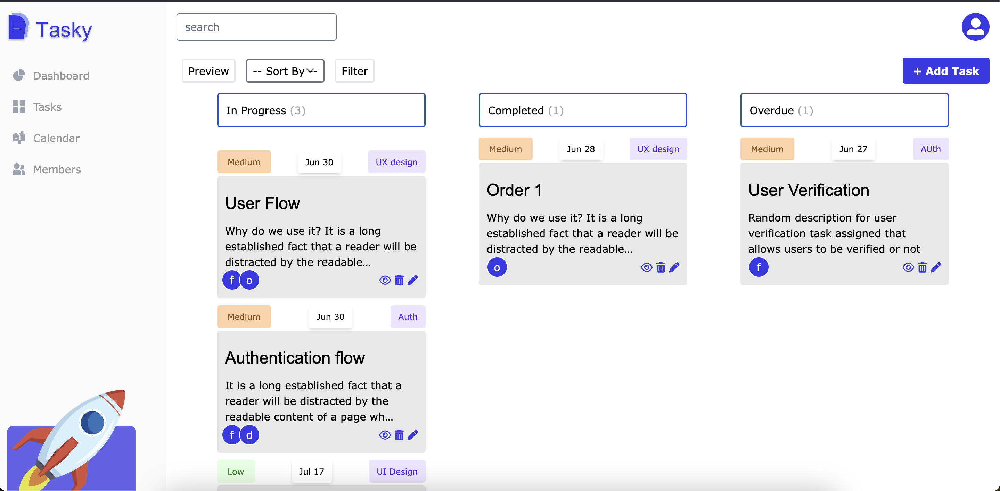

# TASKY

Welcome to you awesome task manager. This app allows you to create and organize your tasks

To get started

* Clone the app
 - Run `git clone https://github.com/funsojoba/tasky.git`
 - Run `cd tasky`

* Create and activate your virtual environment
    - Run `python3 -m venv venv` (For MacBooks)
    - Run `source venv/bin/activate`

* Install dependencies
    - Run `pip install -r requirements.txt`

* Run the app server
    - Run `python manage.py runserver`
    - Your app should run on `http://127.0.0.1:8000` unless a specific port was inputed durning `runserver` code

* Run tailwind server (To get the styling)
    - Run `python manage.py tailwind start`

Happy Hacking 🎉🚀